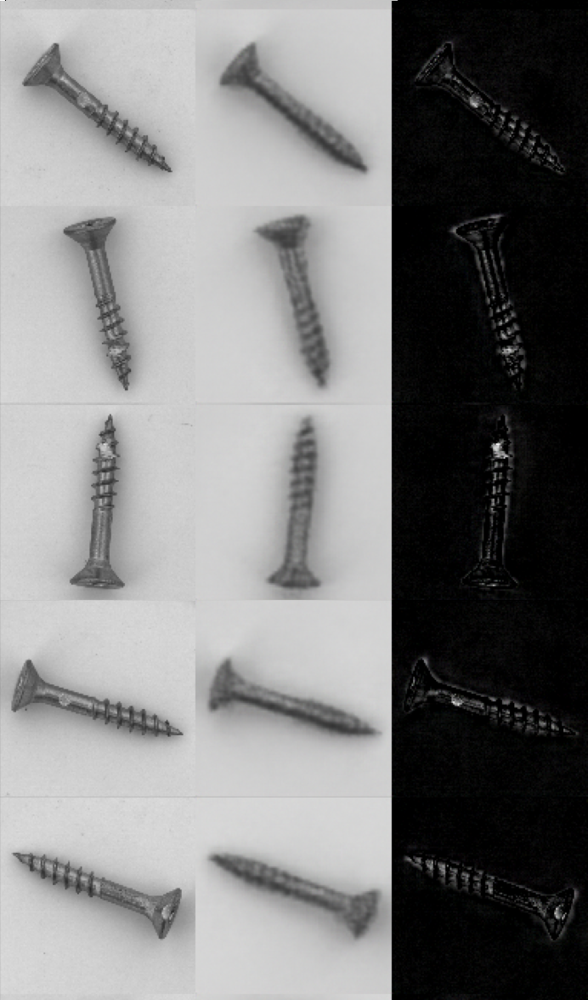

# Autoencoder for Anomaly Detection in MVTec Screws

<p align="center"></p>

## Setup

### Environment

This notebook and package was created in `Python 3.10.6`.
<br>
It is highly recommended to create a new virtual environment in `3.10.6` before executing the following setup.

Run the following code in your terminal to install required libraries & dependencies:
```
cd {your/file/path}/anomaly-detection-screws
make install
```
where `{your/file/path}` is the location where you saved the `anomaly-detection-screws` folder.

### Checking the setup

In the terminal, run:
```
pip list | grep MVTec
```

If the terminal shows the following, then setup has been successful.
```
autoencoder-MVTec-screws       0.0.1
```

## Getting Started

Open `main.ipynb` to get started.


## Next Steps

1. Add L2 regularization penalty
2. Add KL divergence for smoother latent space
3. GAN
